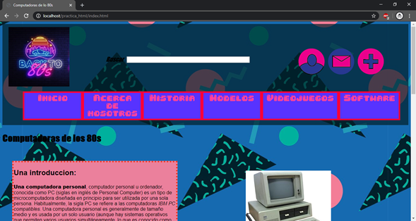

## PÁGINAS HTML

## PAGINA DE COMPUTADORAS DE LOS 8 0

El objetivo de la página web es ilustrar acerca de la computación en la década de los 80s.
mayormente centrándose en ser informativa.

- Página de Inicio (index.html)
    Para la página de inicio tenemos nuestro encabezado que contiene las funciones
    básicas de nuestro sitio (el cual será utilizado en el resto de páginas). Contiene un
    menú horizontal, el logo, una caja de búsqueda y los botones de acción. El menú se
    realizó de la siguiente manera (pagina_inicio.css):

 

La página se ve de esta manera:
```

El resto de la página tiene una estructura de dos columnas junto con otros añadidos
parte de la plantilla brindada en la práctica.

El pie de página contiene tiene un diseño de tres columnas las cueles contienen tres
tipos de información de atención al cliente: Contacto, preguntas frecuentes y las
redes sociales.


Se uso el tag “float” para colocar en sus respectivas columnas al igual que se afectó
redujo su tamaño.

A continuación está la validación de la página en W3C:


```
Solo una advertencia por el lenguaje, la otra es aparentemente por un articulo sin
header, aunque el articulo esta claramente con un h1.
```
- Modelos.html (dos columnas)
    La página de modelos se encuentra en una estructura simple de dos columnas donde
    una de ellas toma una porción menor del espacio total de la página, mientras que la
    otra ocupa más espacio. Se dividió a la página en dos secciones (dos_columnas.css):

```
La página se ve de esta manera:
```

```
A continuación está la validación de la página en W3C:
```
```
Solo una advertencia por el lenguaje, aunque no esta en un lenguaje en específico.
```
- About.html (dos columnas)
    La página de acerca de nosotros se encuentra en una estructura simple de dos
    columnas donde una de ellas toma una porción menor del espacio total de la página,
    mientras que la otra ocupa más espacio. Se dividió a la página en dos secciones
    usando la misma estructura de la página anterior (dos_columnas.css):


La página se ve de esta manera:

A continuación, está la validación de la página en W3C:


```
Solo una advertencia por el lenguaje, aunque no esta en un lenguaje en específico.
```
- Contacto.html (formulario)
    Para acceder a esta página nos dirigimos al pie y damos click en el hipervínculo que
    nos dice “Envíanos un mensaje”:

```
También se puede acceder desde la página de Acerca de Nosotros:
```

La página de contacto es la más simple, se implementó el formulario propuesto en
la práctica:

La página se ve de esta manera:


```
A continuación está la validación de la página en W3C:
```
```
Solo una advertencia por el lenguaje, aunque no está en un lenguaje en específico.
```
- Videojuegos.html (tres columnas)
    Esta página está hecha con un diseño simple en tres columnas usando delimitantes
    entre las distintas secciones donde cada una de las columnas contiene información
    de distinto interés. Se usó la etiqueta “div” para delimitar las columnas
    (tres_columnas.css):


La página se encuentra de esta manera:

A continuación está la validación de la página en W3C:


```
Solo advertencias dadas por el idioma ambiguo y los tags “h1” en algunas
secciones.
```
- Historia.html (dos columnas)
    Esta página consta de un diseño de dos columnas y tres secciones delimitadas por la
    etiqueta “section” para las secciones de la columna y “div” para cada columna. La
    primera columna contiene los links navegación para moverse entre el artículo de
    lanera más eficiente (se usa un overflow con un scroll, dos_columnas.css):


La página se ve de esta manera:


```
A continuación está la validación de la página en W3C:
```
```
A continuación está la validación de la página en W3C:
```
- Software.html (tres columnas)
    La última página se encuentra diseñada con tres columnas, donde dos de ellas
    contienen distintas secciones. Se usó la misma base para la página anterior, pero
    teniendo en cuenta que ahora se tienen secciones en algunas columnas
    (tres_columnas.css).


La página se ve de esta manera:


```
A continuación, está la validación de la página en W3C:
```
```
Solo me da una advertencia por el lenguaje ambiguo.
```
## ARCHIVOS CCS

Existen cinco archivos .css para distinta parte de nuestra página web. A continuación
mostraremos una descripción de su implementación y su validación:

- Encabezado (encabezado.css)


```
Contiene todo el layout del encabezado que se encuentra en todas las secciones de
nuestra página web. Su explicación básica se realizó anteriormente.
```
```
La validación en W3C:
```
- Pie de página (pie_página.css)
    Contiene el layout del pie de página que se encuentra en todas las secciones de
    nuestra página web. Su funcionalidad básica se explicó anteriormente.

```
La validación en W3C:
```

- Página de inicio (pagina_inicio.css)
    Contiene todos los estilos de la página principal mostrada anteriormente.

```
La validación en W3C:
```

- Layout de dos columnas (dos_columnas.css)
    Contiene los layouts de las secciones con dos columnas (historia, about, modelos).

```
La validación en W3C:
```

- Layout de tres calumnas (tres_columnas.css)
    Contiene los layouts de las secciones con tres columnas (videojuegos, software).

```
La validación en W3C:
```


# practica_html
Estructurar un sitio web estático usando HTML5. El sitio web será informativo sobre un tema que será autoría del estudiante.
PÁGINAS HTML
El objetivo de la página web es ilustrar acerca de la computación en la década de los 80s. mayormente centrándose en ser informativa.

Página de inicio (index.html)
Está pensada en la rápida navegabilidad del usuario, con íconos grandes en un menú.
También contiene una parte de introducción para captar la atención del usuario hacerca del tema de la página. Incluye un video del tema.

Página de Acerca de nosotros (about.html)
Solo indica el objetico del sitio de una manera clara y concisa. También indica la información de contacto.

Página de Historia (historia.html)
Contiene una cantidad grande de información sobre el tema de computadoras y su historia. Se usa un menú para rápida navegabilidad entre artículos y secciones.

Página de videojuegos (videojuegos.html)
Es la parte más dirigida al entretenimiento y al principio te da la opción de reproducir una canción con temática de los 80s mientras lees el contenido.
También contiene un video mostrando uno de los juegos más famosos en las PCs de los 80s.

Página de modelos (modelos.html)
Es una página de información acerca de los principales modelos y fabricantes de la época. Se usa tablas y listas para que la información sea más fácil de absorber.

Página de software (software.html)
Esta página no entra en tanto detalle, pero ahonda en la importancia de los 80s en la creación del internet y el software actual. De igual manera contiene imágenes y listas para que la información sea más amigable.

Gracias a esta práctica he aprendido a usar las etiquetas básicas de HTMl y he podido realizar una estructura básica de una página. Tener una página web ordenada y usar las etiquetas de manera correcta nos ayudan a hacerla manejable y fácil de mantener.
El trabajo más complicado fue encontrar algunos errores, el contexto en el que se puede usar ciertas etiquetas no es del todo claro pero al final he comprendido mucho sobre en que situación puedo usar una etiqueta y en cual situación no.